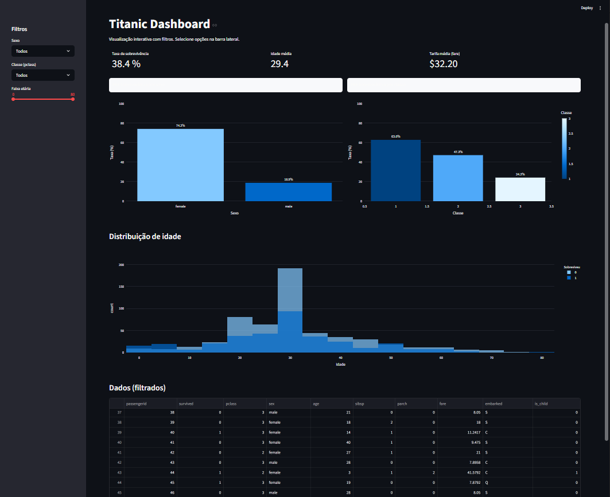

# Titanic Data Pipeline com Streamlit

## Visão geral

Projeto demonstrativo que implementa um pipeline local e reprodutível usando o dataset Titanic. Cobre ingestão, transformação, checagem de qualidade, persistência e visualização com Streamlit.

## Funcionalidades

- Extração do CSV público do Titanic
- Limpeza e engenharia de features com Pandas
- Validações básicas de qualidade de dados
- Persistência em Parquet e SQLite para análises
- Dashboard interativo com Streamlit e Plotly

## Arquitetura (camadas)

- Ingestão: scripts em `src/extract.py` que baixam/salvam dados brutos em `data/raw/`
- Raw: snapshots imutáveis em CSV em `data/raw/`
- Processamento: limpeza e transformações em `src/transform.py`
- Qualidade: validações em `src/quality.py`
- Persistência: Parquet + gravação em SQLite via `src/load.py`
- Serving: dashboard em `app/app.py` (Streamlit)

Fluxo: Data Source → src.extract → data/raw → src.transform → src.quality → src.load → SQLite → Streamlit

## Como executar (Windows)

1. Criar e ativar ambiente virtual:

   - python -m venv venv
   - venv\Scripts\activate

2. Instalar dependências:

   - python -m pip install -r requirements.txt

3. Executar pipeline (gera Parquet/SQLite):

   - python main.py

4. Rodar o dashboard:
   - streamlit run app/app.py

## Estrutura do projeto (resumo)

- app/app.py — Streamlit dashboard
- src/extract.py — ingestão
- src/transform.py — transformação
- src/quality.py — checagens de qualidade
- src/load.py — persistência
- data/ — CSVs brutos, Parquet e SQLite
- requirements.txt — dependências

## Dashboard Preview

Este dashboard demonstra a camada de consumo do pipeline, onde os dados processados armazenados no SQLite são consultados e visualizados utilizando o Streamlit.

## Licença

MIT
